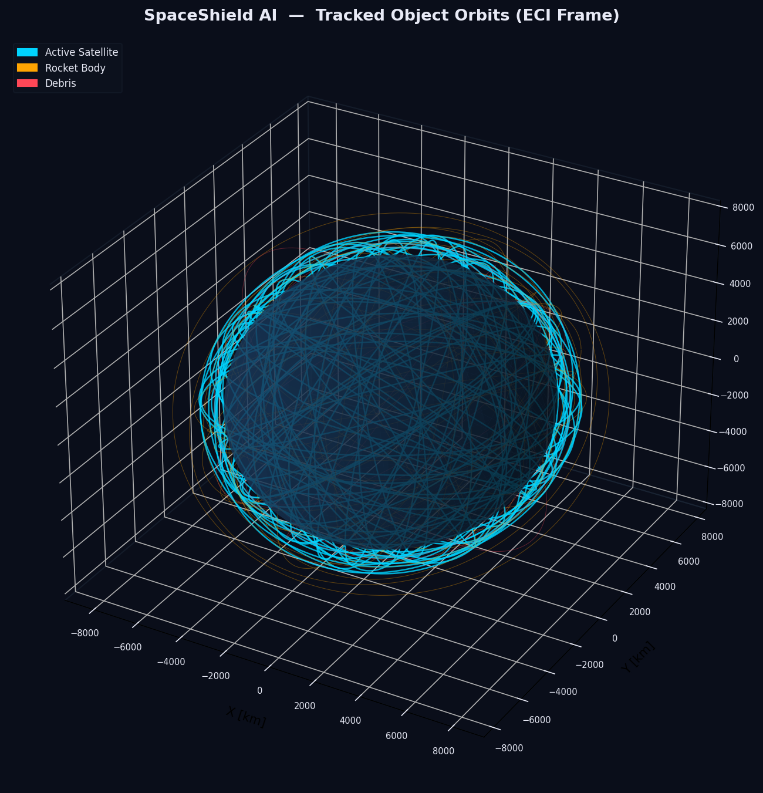
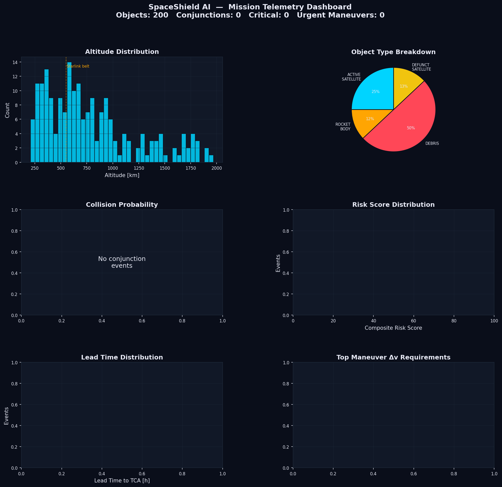
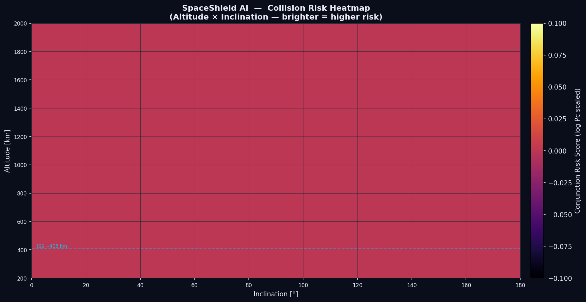
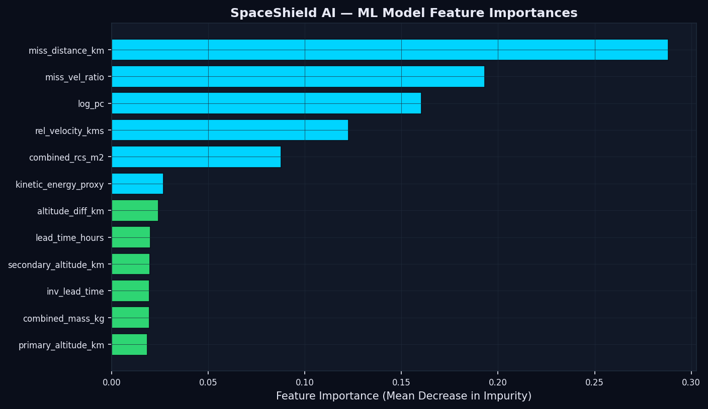

# 🚀 SpaceShield AI

AI-Powered Autonomous Space Collision Avoidance & Orbital Threat Analysis System

## 📌 Overview

SpaceShield AI is an advanced space situational awareness and orbital defense platform designed to detect, analyze, and mitigate collision risks between active satellites and space debris.

The project combines:

- Orbital Mechanics Simulation
- Collision Probability Estimation
- AI-Based Risk Classification
- Autonomous Maneuver Recommendation
- Telemetry Visualization
- Threat Heatmaps & Analytics

The system simulates hundreds of orbital objects in Earth orbit and evaluates potential conjunction events using probabilistic and machine learning approaches.

---

# ✨ Features

## 🛰 Orbital Simulation Engine
- Simulates active satellites, debris, and rocket bodies
- Generates realistic orbital distributions
- ECI-frame visualization

## ⚠ Collision Detection
- Conjunction analysis
- Miss distance computation
- Relative velocity estimation
- Time-to-closest-approach prediction

## 🤖 AI Risk Assessment
Machine learning model analyzes:
- Miss distance
- Relative velocity
- Collision probability
- Lead time
- Orbital altitude

Outputs:
- GREEN
- YELLOW
- ORANGE
- RED threat levels

## 🧠 Autonomous Maneuver Recommendation
Suggests orbital avoidance maneuvers based on:
- Risk level
- Delta-V estimation
- Fuel efficiency
- Orbital constraints

## 📊 Visualization Dashboard
Includes:
- Telemetry dashboard
- Risk heatmaps
- Orbit tracking
- Feature importance analysis

---

# 🖼 Project Visualizations

## 🌍 Tracked Orbital Objects



---

## 📡 Mission Telemetry Dashboard



---

## 🔥 Collision Risk Heatmap



---

## 🤖 ML Feature Importance



---

## 📈 Threat Distribution Analysis


---

# 🏗 Project Structure

```bash
SpaceShield-AI/
│
├── src/
│   ├── simulation/
│   ├── collision/
│   ├── ml/
│   ├── maneuvers/
│   └── visualization/
│
├── tests/
├── scripts/
├── data/
├── docs/
├── results/
└── README.md
